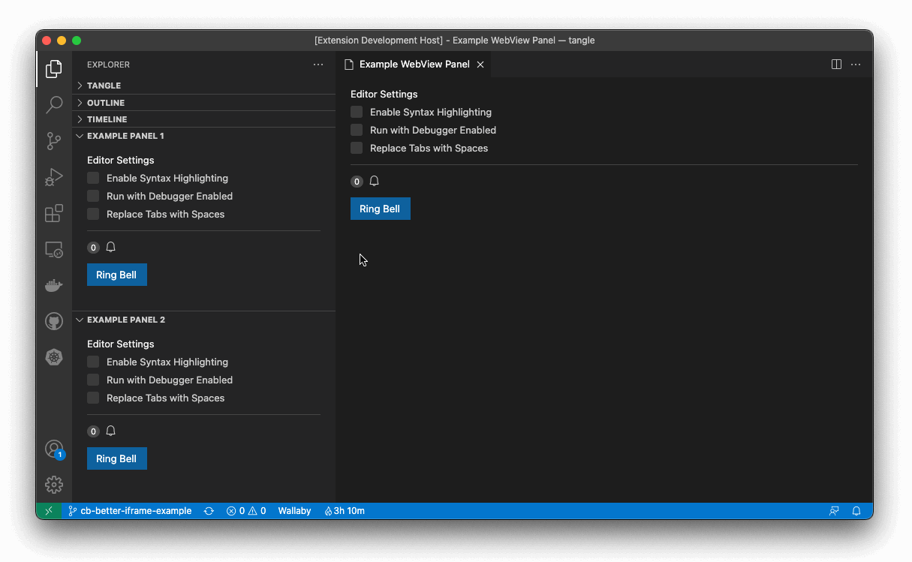

An Awesome VSCode Extension
===========================

This extension is a best practices guide for writing great VSCode extensions. It can be used as boilerplate template to start of with a new extension.

## Features

In itself this extension doesn't do much. It has some webviews, panels and commands implemented to show you how to interact with the [VSCode APIs](https://code.visualstudio.com/api/references/vscode-api).

The current version looks as follows:

<!--
ToDo(Christian): https://github.com/stateful/vscode-awesome-ux/issues/8
## Extension Settings

Include if your extension adds any VS Code settings through the `contributes.configuration` extension point.

For example:

This extension contributes the following settings:

* `myExtension.enable`: enable/disable this extension
* `myExtension.thing`: set to `blah` to do something
 -->
<!--
ToDo(Christian); https://github.com/stateful/vscode-awesome-ux/issues/9
## Release Notes

Users appreciate release notes as you update your extension.

### 1.0.0

Initial release of ...

### 1.0.1

Fixed issue #.

### 1.1.0

Added features X, Y, and Z.
-->
